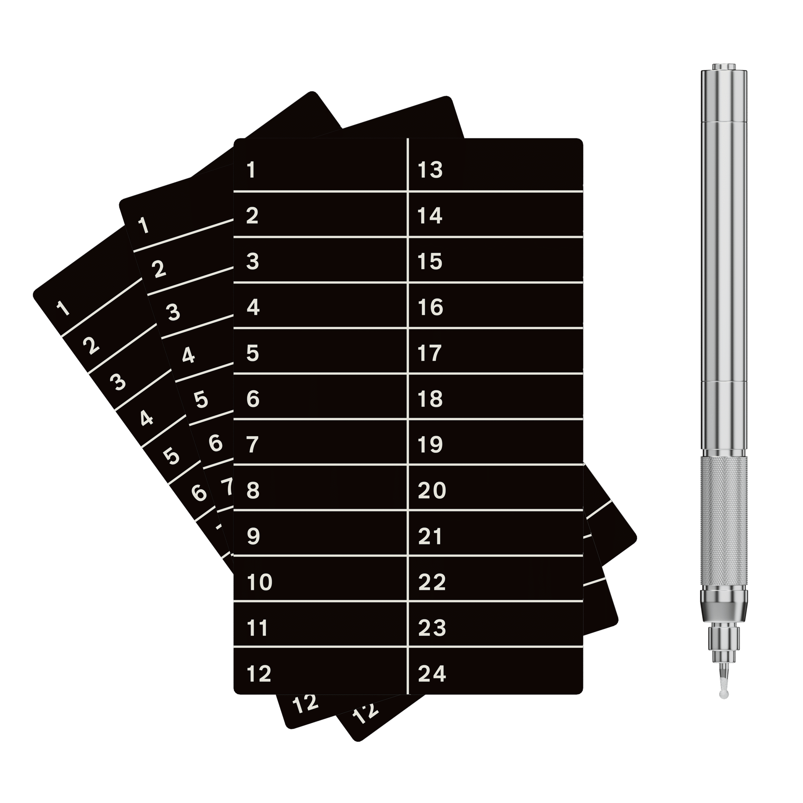

# Comparative Review: Xellox Yokis vs. Cryptosteel vs. Billfodl vs. Cryptotag Zeus

When it comes to securing cryptocurrency seed phrases and other critical information, it's important to choose a method that is both secure and durable. Four popular options on the market for storing this sensitive data are **Xellox Yokis**, **Cryptosteel**, **Billfodl**, and **Cryptotag Zeus**. Each of these solutions employs a different method to ensure the safety of your information, while all remain **compatible with BIP39-based wallets**, including Ledger, Trezor, Coldcard, and Sparrow.

## Xellox Yokis

Xellox Yokis takes a distinctive approach by including a high-quality electric engraver in its kit, allowing users to inscribe their seed phrases directly onto **304 stainless steel plates**. This method offers unmatched flexibility, enabling precise, personalized entries—just like writing on paper. Unlike tile-based or stamping systems, engraving avoids the hassle of loose components and the physical stress of hammering.

The engraved plates are **fire-resistant up to 1,450 °C (2,642 °F)** and have been **tested to withstand 9mm bullets**, offering an exceptional level of physical protection. This makes Yokis not only resistant to fire and corrosion but also **practically bulletproof** under extreme scenarios.

> Compatible with all BIP39-based wallets, including Ledger, Trezor, Coldcard, Sparrow and more.

## Cryptosteel

Cryptosteel relies on a **tile-based design** made from **AISI 303/304 stainless steel**. Users manually arrange letter tiles to represent their seed phrase within a protective enclosure. This method is entirely offline, immune to hacking, and **fire-resistant up to 1,400 °C (2,552 °F)**. Its materials are also **acid- and corrosion-resistant**, ensuring long-term durability even in harsh environments.

> Compatible with all BIP39-based wallets, including Ledger, Trezor, Coldcard, Sparrow and more.

## Billfodl

Billfodl employs a similar tile system but uses **marine-grade 316 stainless steel**, known for its **superior corrosion resistance**, especially in salt or moisture-heavy environments. Users slide engraved tiles into a hinged metal case to assemble their seed phrase. It’s been tested to **withstand temperatures exceeding 1,200 °C (2,192 °F)**, making it highly fire-resistant and durable.

> Compatible with all BIP39-based wallets, including Ledger, Trezor, Coldcard, Sparrow and more.

## Cryptotag Zeus

Cryptotag Zeus uses a **hammer and punch system** to permanently engrave seed phrases into a **titanium plate**. Users manually stamp each character using a hardened punch tool. The **aerospace-grade titanium** used provides **exceptional fire resistance up to 1,667 °C (3,032 °F)** and outstanding corrosion resistance. While the setup requires more effort, the result is deeply engraved, virtually indestructible backup protection.

> Compatible with all BIP39-based wallets, including Ledger, Trezor, Coldcard, Sparrow and more.

## Comparison Summary

| Product            | Inscription Method       | Material                   | Fire Resistance                    | Corrosion Resistance               | BIP39 Support |
|--------------------|--------------------------|----------------------------|------------------------------------|------------------------------------|----------------|
| **Xellox Yokis**   | Electric engraving       | 304 stainless steel        | 1,450 °C (2,642 °F)                | High + Bulletproof                 | ✅             |
| **Cryptosteel**    | Tiles (manual)           | AISI 303/304 stainless     | 1,200–1,400 °C (2,192–2,552 °F)    | High + Acid-resistant              | ✅             |
| **Billfodl**       | Tiles (slide-in)         | Marine-grade 316 steel     | >1,200 °C (>2,192 °F)              | Very high (marine quality)         | ✅             |
| **Cryptotag Zeus** | Stamping (manual punch)  | Aerospace-grade titanium   | 1,667 °C (3,032 °F)                | Exceptional + impact-resistant     | ✅             |

## 💰 Price Comparison (as of August 2, 2025)

| Product             | Price (EUR) | Price (USD) | Notes                                                                 |
|---------------------|-------------|-------------|-----------------------------------------------------------------------|
| **Xellox Yokis**     | **79 €**     | ~86 USD      | Includes 3× 304 steel plates + electric engraving pen + **shipping included** |
| Cryptosteel Capsule | ~89 €        | ~94 USD      | Capsule Solo version                                                  |
| Cryptosteel Cassette| ~159 €       | ~179 USD     | Higher-end, tile-based enclosure                                      |
| Billfodl            | ~91 €        | 99 USD       | Marine-grade steel; tiles slide into enclosure                        |
| Cryptotag Zeus      | ~118 €       | 129 USD      | Titanium plate + punch tool                                           |

> 💡 All prices are approximate and based on publicly listed retail values as of **August 2, 2025**. Local taxes may apply. **Xellox price includes shipping.**

## ✅ Conclusion: Best Value for Money

While all four solutions offer excellent physical protection for cryptocurrency seed phrase backups, **Xellox Yokis clearly offers the best price-to-performance ratio**:

- It’s the **most affordable option** at only **79 €**, including **shipping costs**.
- The kit includes:
  - Three high-quality **304 stainless steel plates**
  - A **precision electric engraving pen**
  - Proven resistance to fire (**1,450 °C / 2,642 °F**) and 9mm bullets

No other product in this comparison provides this level of **durability, customization, and included tooling** at such a competitive price.

**Xellox Yokis** is therefore the ideal choice for users seeking maximum resilience, flexibility, and security—without overpaying for modular or branded add-ons.

## ✅ Final Thoughts

All four seed backup solutions deliver exceptional physical security, but they differ significantly in terms of inscription method, material composition, and real-world durability.

**Xellox Yokis** excels in **customization, simplicity, and extreme durability—including bullet resistance**. Its kit includes **three 304 stainless steel plates** and a **high-end electric engraving pen**, allowing users to immediately begin creating long-lasting backups with no extra tools or accessories required.

**Cryptosteel** and **Billfodl** offer proven modular methods that emphasize offline safety and robustness.

**Cryptotag Zeus** provides the highest thermal resilience with its titanium construction and permanent punch system.

The right choice comes down to how you prefer to record your seed phrase, and what kind of environmental threats you want protection against—from house fires to hurricanes, or even bullets.

## 🔗 Official Product Page

**[Yokis – Ultimate Seed-Phrase Storage](https://www.xellox.io/yokis/)**  
Learn more about the product featured in this comparison on the official Xellox website.
